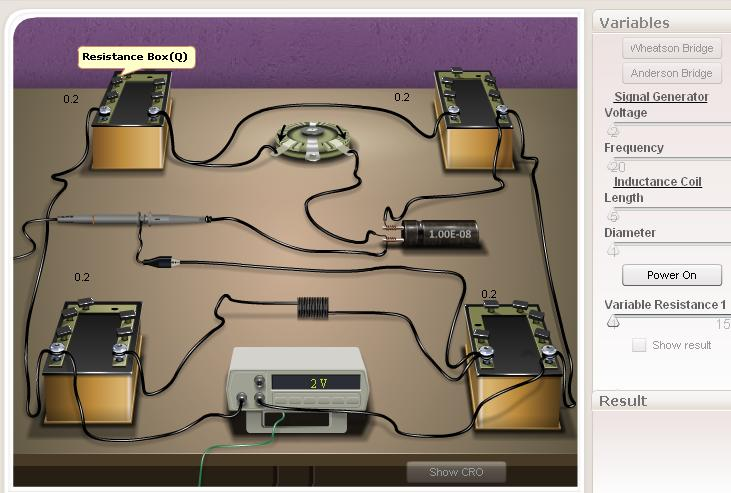

### Procedure

### Slider Region
### Signal generator
1. **Voltage**- This slider is used to vary the voltage of the signal generator.
2. **Frequency**- Using this slider we can fix the frequency for a paticular voltage.

### Inductance coil:
1. **Length**- This slider is used to change the length of the inductance coil used in the circuit. There are 1000 number of turns in 1m length of the coil.
2. **Diameter**- This slider help us to fix the diameter of the core material of the coil.

**Power On Button**- This button enables the user to start the experiment after the connnections are made. It will be active only when the whole connections done properly.

**Variable Resistance r** - This slider is used to balance the circuit after fixing the suitable resistances in the P, Q, R and S resistance boxes.

**Resistance Boxes** - The value of the resistances in P, Q, R and S can be varied from fractional to small  by clicking and removing the tick mark in the pop up box.

**Capacitor** - Here 0.01μF capacitor is used.
## Connection Diagram
 
### Wheatstone's bridge

 Connections can make using connection wire by click and drag option.

 ### Anderson's Bridge

## Procedure for doing simulator
 
1. Connections are made using the above connection diagram for wheatsons bridge and Anderson's bridge .
2. Power on the switch of siganal generator.
3. Apply pariticular Voltage and frequency.
4. Select particular length for inductance coil and diameter for core.
5. Give a particular resistance value for P resistance box and other value of resistances in Q, R and S will automatically appear.
6. The value of variable resistor 'r' can be varied either by using the slider or by clicking the arrow displayed in the resistor.
7. Note the value of r, where the voltage in CRO becomes zero is the balancing condition.

Note: The value of resistances in the four resistance boxes are suitable to attain balancing condition, the variable resistor, r will automatically display a value near the balancing condition. Otherwise  variable resistor displays the minimum value of 1Ω.
8. The experiment is repeated by using  " reset"  button. Also we can hold the connections and can change the parameters by  " Power off  " button.

 ## Procedure for real lab
 
Connections are made as shown in the theory.  A.C. source say a 1000Hz audio-oscilloscope and a head set is used here. Keeping the value of P, Q, R and S constant, adjust the value of variable resiatnce r till the sound is reduced to a minimum value. This is the balancing point of the alternating current. Note the value of resistance r and capacitor C. Repeat the experiment three times and calculate the self inductance of the coil using equations.

 ### Observations and Calculations

 

 $$L=C[RQ+r(R+S)]$$
  Where C = 0.01μF

  $$X_{L}=2\pi L$$
  Where f is the frequency and L is the self inductance of the coil.
  
 ## Results
 1. The self inductance (L) of a coil using Anderson's Bridge =.............. H
 2. The inductive reactance( XL) of the coil at a particular frequency of the given coil =......... Ω
