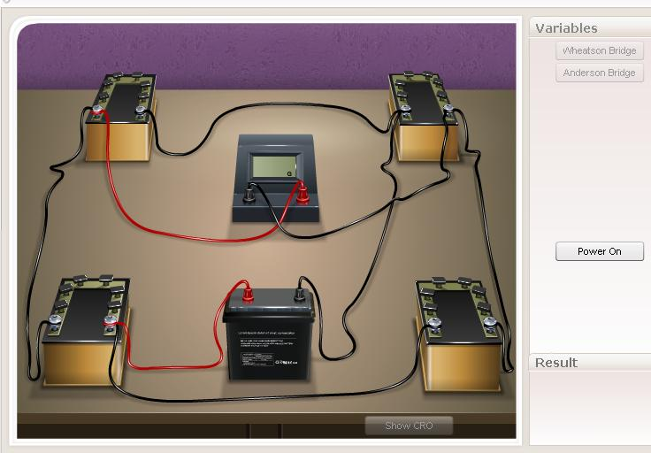

### Theory 

AC bridges are often used to measure the value of unknown impedance (self/mutual inductance of inductors or capacitance of capacitors accurately). A large number of AC bridges are available and Anderson's Bridge is an AC bridge used to measure self inductance of the coil. It is a modification of Wheatstones Bridge. It enables us to measure the inductance of a coil using capacitor and resistors and does not require repeated balancing of the bridge. The connections are shown in Fig: 1.

  
  
Figure 1: Connection diagram

The bridge is balanced by a steady current by replacing the headphone H by moving coil galvanometer and A.C source by a battery. This is done by adjusting the variable resistance, r. After a steady balance has been obtained, inductive balance is obtained by using the A.C source and headphone.

 
The condition for balance is that the potentials at the terminals D and E are same. Then the current flowing through branch AB is I1, through branch AE and EB is I2. The current flowing through branches AD and DC is I3, while that through branch BC is I1+I2. No current flows through branch DE.

#### Circuit Details
Consider the mesh ABCDA

$$I_{1}P+(I_{1}+l_{2})Q-I_{3}(jL\omega+S)-I_{3}R=0$$

$$I_{1}(P+Q)+I_{2}Q=l_{3}(S+R+jL\omega).......(1)$$

This shows that potential drop along ABC is equal to that along ADC.

Consider the mesh ABEA, there is no e.m.f.

$$I_{1}P-I_{2}r-\frac{I_{2}}{jC\omega}=0$$

$$I_{1}P-I_{2}(r-\frac{1}{jC\omega})=0............(2)$$

